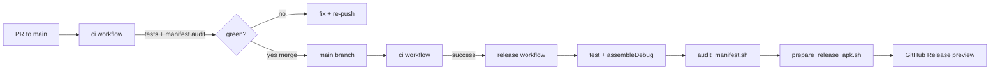

# Release & Deployment Runbook

## Channels

| Channel | Tag | When it publishes | Install target |
|---|---|---|---|
| **Rolling preview** | `preview` | After `ci` passes on `main` | **Default for device testing** |
| **Versioned snapshot** | `v*` (e.g. `v1.1.0-preview`) | On git tag push | Milestone / audit snapshots |

## Pipeline (production standard)



### Guarantees
1. **No release without green CI** — `release` triggers via `workflow_run` after `ci` succeeds on `main`.
2. **Traceable artifacts** — APK filename includes version, build number, and git SHA.
3. **Checksums** — `.sha256` sidecar uploaded with every APK.
4. **Metadata** — `release-metadata.json` records version, commit, workflow run.
5. **Rolling `preview` is Latest** — stale milestone tags are not the default install target.

## Install (Realme GT 6T)

1. Open [Releases](https://github.com/laraib-sidd/khidki/releases) → **Khidki preview (rolling)** (`preview` tag).
2. Download the `khidki-*-debug-b*.apk` (not the old generic `app-debug.apk` on legacy tags).
3. Optional: verify `sha256sum -c <apk>.sha256`.
4. Sideload over existing Khidki debug build (same keystore; requires higher `versionCode`).

> **Physical test note (2026-09-11):** Build `1.1.0` confirmed SMS receive on device. End-to-end OTP forward pending armed window. See `docs/PHYSICAL_TEST.md` and `docs/COORDINATION.md` blockers.

## Manual release trigger

```bash
gh workflow run release.yml --ref main
```

Use only when recovering from a failed publish — normal path is merge → CI → release.

## Versioned milestone release

```bash
git tag -a v1.1.0-preview -m "Phase 6 UI/UX revamp"
git push origin v1.1.0-preview
```

Creates an immutable release with the same artifact packaging.

## Secrets (optional)

| Secret | Purpose |
|---|---|
| `KHIDKI_PREVIEW_KEYSTORE_BASE64` | Override committed debug keystore (base64). Default: use repo keystore. |

## Local parity

```bash
export KHIDKI_VERSION_CODE=999
./gradlew :app:testDebugUnitTest :app:assembleDebug
bash scripts/audit_manifest.sh
export KHIDKI_VERSION_NAME=1.1.0
bash scripts/prepare_release_apk.sh
ls -la release-artifacts/
```
