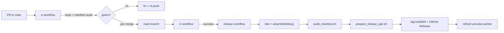

# Release & Deployment Runbook

## Channels

| Channel | Tag | When it publishes | Install target |
|---|---|---|---|
| **Per-build (immutable)** | `build/b<N>` | After `ci` passes on `main` (one per merge/push) | Pin a specific build for audit/debug |
| **Rolling preview** | `preview` | Same run — updated to match latest `build/b<N>` | **Default for device testing** (stable URL) |
| **Versioned snapshot** | `v*` (e.g. `v1.1.0-preview`) | On manual git tag push | Milestone / audit snapshots |

Example: merge to `main` → CI green → release workflow creates **`build/b48`** (immutable) **and** refreshes **`preview`** (same APK).

## Pipeline (production standard)



### Guarantees
1. **No release without green CI** — `release` triggers via `workflow_run` after `ci` succeeds on `main`.
2. **Traceable artifacts** — APK filename includes version, build number, and git SHA.
3. **Immutable history** — every main push gets a unique `build/b<N>` tag and release (never overwritten).
4. **Checksums** — `.sha256` sidecar uploaded with every APK.
5. **Metadata** — `release-metadata.json` records version, commit, workflow run, and `releaseTag`.
6. **Latest = newest build** — `make_latest: true` on each `build/b<N>`; `preview` is a stable alias.

## Install (Realme GT 6T)

**Option A — latest (recommended):**
1. [Releases](https://github.com/laraib-sidd/khidki/releases) → filter **Latest** or open **`preview`**.
2. Download `khidki-*-debug-b*.apk`.

**Option B — pin a specific build:**
1. [Releases](https://github.com/laraib-sidd/khidki/releases) → pick `build/b47` (or whatever build you tested).
2. Download that release's APK + optional `.sha256` verify.

3. Sideload over existing Khidki debug build (same keystore; requires higher `versionCode`).

> **Physical test note:** Record the `build/b<N>` tag in trial notes so results are reproducible.

## Manual release trigger

```bash
gh workflow run release.yml --ref main
```

Creates a new `build/b<N>` (increments release workflow run number). Use only when recovering from a failed publish.

## Versioned milestone release

```bash
git tag -a v1.2.0-preview -m "Phase 7 timed forwarding"
git push origin v1.2.0-preview
```

Creates an additional immutable release at that tag (does not replace `build/b*` history).

## Secrets (optional)

| Secret | Purpose |
|---|---|
| `KHIDKI_PREVIEW_KEYSTORE_BASE64` | Override committed debug keystore (base64). Default: use repo keystore. |

## Local parity

```bash
export KHIDKI_VERSION_CODE=999
export KHIDKI_RELEASE_TAG=build/b999
export KHIDKI_RELEASE_CHANNEL=build
./gradlew :app:testDebugUnitTest :app:assembleDebug
bash scripts/audit_manifest.sh
export KHIDKI_VERSION_NAME=1.1.0
bash scripts/prepare_release_apk.sh
ls -la release-artifacts/
```
