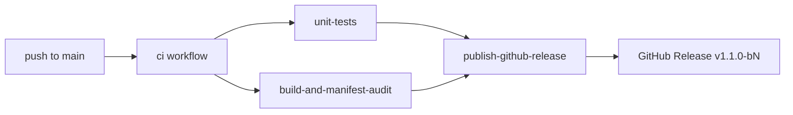

# Release & Deployment Runbook

## How releases work

Every push to `main` runs CI. When tests and manifest audit pass, the **same workflow** publishes a GitHub Release:

| Field | Example |
|---|---|
| **Git tag** | `v1.1.0-b17` |
| **Release name** | `Khidki v1.1.0-b17` |
| **APK** | `khidki-1.1.0-debug-b17-abc1234.apk` |

- `b17` = CI workflow run number (also Android `versionCode`)
- Each release is **immutable** — never overwritten
- **Latest** on GitHub Releases always points to the newest `main` build

Manual milestone? Push a git tag:

```bash
git tag -a v1.2.0 -m "Phase 8"
git push origin v1.2.0
```

CI runs on the tag and publishes a release at that exact tag name.

## Pipeline



## Install (Realme GT 6T)

1. Open [GitHub Releases](https://github.com/laraib-sidd/khidki/releases) → **Latest**
2. Download `khidki-*-debug-b*.apk`
3. Optional: `sha256sum -c <apk>.sha256`
4. Sideload over existing Khidki debug build (same keystore; needs higher `versionCode`)

Record the `v1.1.0-b<N>` tag in physical test notes.

## Manual re-publish

```bash
gh workflow run ci.yml --ref main
```

Only for recovery — normal path is merge → CI → release.

## Secrets (optional)

| Secret | Purpose |
|---|---|
| `KHIDKI_PREVIEW_KEYSTORE_BASE64` | Override committed debug keystore (base64) |

## Local parity

```bash
export KHIDKI_VERSION_CODE=999
export KHIDKI_RELEASE_TAG=v1.1.0-b999
export KHIDKI_RELEASE_CHANNEL=ci
./gradlew :app:testDebugUnitTest :app:assembleDebug
bash scripts/audit_manifest.sh
export KHIDKI_VERSION_NAME=1.1.0
bash scripts/prepare_release_apk.sh
ls -la release-artifacts/
```
