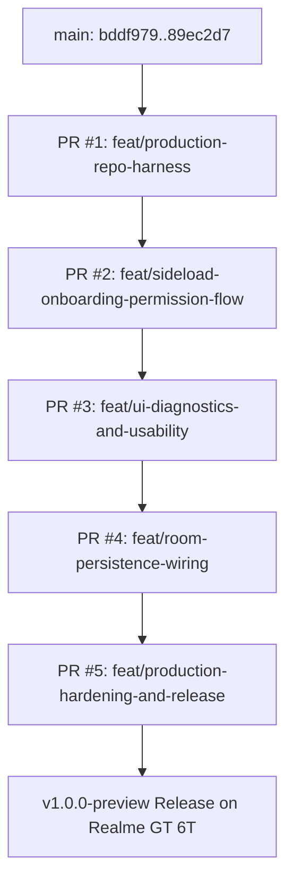

# Khidki Production Hardening & Multi-PR Implementation Plan

> **For agentic workers:** REQUIRED SUB-SKILL: Use superpowers:subagent-driven-development (recommended) or superpowers:executing-plans to implement this plan task-by-task. Steps use checkbox (`- [ ]`) syntax for tracking.
> Always coordinate with `docs/COORDINATION.md` before starting and after completing any phase.

**Goal:** Transform Khidki from an initial working prototype into a production-grade Android repository with robust CI/CD, reproducible APK signing, seamless Android 15/16 sideload onboarding, live on-device diagnostics, and fully persisted security invariants—delivered across 5 discrete, reviewable Pull Requests with atomic commits.

**Architecture:** 
- **Repo & CI/CD:** Dual-workflow GitHub Actions setup (`ci.yml` for PR validation and merged manifest security audit; `release.yml` for deterministic debug keystore signing and GitHub Releases), PR/issue templates, Dependabot, and CONTRIBUTING guide.
- **Onboarding UX:** Pre-flight permission gate handling Android 15/16 "Restricted Settings" with deep-linking to system App Info, plus OEM-specific (Realme UI) Auto-start guidance.
- **UI Diagnostics:** In-memory circular event buffer rendered live on the Status tab for zero-ADB testing, one-tap command clipboard copy, real session cancellation state transitions, inline RE2 regex syntax validation, and live countdown timer.
- **Persistence Wiring:** Replace in-memory fakes in `KhidkiRuntime` with persistent Room adapters for `RoomLockoutStore`, `RoomBudgetLedger`, and `RoomDuplicateFingerprintStore`.

**Tech Stack:** Kotlin 2.1.20, Android Gradle Plugin 8.9.1, Gradle 8.13, Jetpack Compose Material 3, Room 2.6.1, Android Keystore (HMAC-SHA256), Google RE2/J, libphonenumber, GitHub Actions, GitHub CLI (`gh`).

---

## Roadmap & PR Breakdown



| Phase / PR | Target Branch | Key Deliverable | PR Title |
|---|---|---|---|
| **Phase 1** | `feat/production-repo-harness` | Production CI/CD, Manifest Audit, Deterministic Keystore, PR/Issue Templates, Dependabot | `feat(ci): establish production CI/CD, deterministic signing, and repo harness` |
| **Phase 2** | `feat/sideload-onboarding-permission-flow` | Android 15/16 Restricted Settings Pre-flight, App Info Deep Link, Realme Guide | `feat(ui): add sideload permission pre-flight and OEM background onboarding` |
| **Phase 3** | `feat/ui-diagnostics-and-usability` | In-app Status Event Log, 1-Tap Command Copy, Real Session Cancel, RE2 Validator, Countdown | `feat(ui): add live test event stream, 1-tap command copy, session cancel, and regex validation` |
| **Phase 4** | `feat/room-persistence-wiring` | Wire RoomLockoutStore, RoomBudgetLedger, and RoomDuplicateFingerprintStore into Runtime | `feat(data): wire Room persistence for lockouts, SMS budget, and duplicate fingerprints` |
| **Phase 5** | `feat/production-hardening-and-release` | Active window status notification, updated physical test runbook, CHANGELOG, Release tag | `chore(release): finalize production runbook, changelog, and v1.0.0-preview tag` |

---

## Phase 1: Production Harness & Repo Standards (PR #1)

**Branch:** `feat/production-repo-harness` (from `main`)  
**Base:** `main`

### Task 1.1: Deterministic Preview Debug Keystore
Currently, GitHub Actions generates an ephemeral debug keystore per runner run. Sideloading updated builds fails with `INSTALL_FAILED_UPDATE_INCOMPATIBLE` unless uninstalled first. We configure a deterministic debug keystore file or script with standard credentials (`android`/`androiddebugkey`), committed in `app/debug-keystore/debug.keystore`, and configure `build.gradle.kts` to use it for debug builds if no custom secret is provided.

**Files:**
- Create: `app/debug-keystore/debug.keystore`
- Modify: `app/build.gradle.kts`

- [ ] **Step 1: Generate deterministic debug keystore**
Run keytool command:
```bash
keytool -genkey -v -keystore app/debug-keystore/debug.keystore -alias androiddebugkey -keyalg RSA -keysize 2048 -validity 10000 -storepass android -keypass android -dname "CN=Android Debug,O=Android,C=US"
```

- [ ] **Step 2: Configure debug signing in `app/build.gradle.kts`**
Add deterministic signing config:
```kotlin
    signingConfigs {
        getByName("debug") {
            storeFile = file("debug-keystore/debug.keystore")
            storePassword = "android"
            keyAlias = "androiddebugkey"
            keyPassword = "android"
        }
    }
```

- [ ] **Step 3: Test assembleDebug locally**
Run: `./gradlew :app:assembleDebug`
Expected: SUCCESS with signed APK using deterministic keystore.

- [ ] **Step 4: Commit**
```bash
git add app/debug-keystore/debug.keystore app/build.gradle.kts
git commit -m "build: configure deterministic debug signing keystore for sideload updates"
```

---

### Task 1.2: Production CI Workflows (`ci.yml` & `release.yml`) & Manifest Audit
Split CI into:
1. `.github/workflows/ci.yml`: Runs on PRs to `main` and branch pushes. Executes lint, unit tests, manifest security audit script (fails if `android.permission.INTERNET` is in merged manifest), and debug assemble.
2. `.github/workflows/release.yml`: Runs on push to `main` and tags `v*`. Builds APK and publishes `preview` release.
3. Remove old single `.github/workflows/apk.yml`.

**Files:**
- Create: `scripts/audit_manifest.sh`
- Create: `.github/workflows/ci.yml`
- Create: `.github/workflows/release.yml`
- Delete: `.github/workflows/apk.yml`

- [ ] **Step 1: Create Manifest Security Audit script**
`scripts/audit_manifest.sh`:
Checks `app/build/intermediates/merged_manifest/debug/processDebugMainManifest/AndroidManifest.xml` or source manifest to ensure `android.permission.INTERNET` is NEVER present.

- [ ] **Step 2: Create `.github/workflows/ci.yml`**
Multi-job workflow with caching for Gradle wrapper and dependencies:
- Job 1: `test` (`./gradlew :app:testDebugUnitTest`)
- Job 2: `build-and-audit` (`./gradlew :app:assembleDebug && bash scripts/audit_manifest.sh`)

- [ ] **Step 3: Create `.github/workflows/release.yml`**
Runs on push to `main`, creates GitHub Release with `app-debug.apk`.

- [ ] **Step 4: Verify audit script locally**
Run: `chmod +x scripts/audit_manifest.sh && ./gradlew :app:assembleDebug && bash scripts/audit_manifest.sh`
Expected: "PASS: Merged manifest contains no INTERNET permission."

- [ ] **Step 5: Commit**
```bash
git rm .github/workflows/apk.yml
git add scripts/audit_manifest.sh .github/workflows/ci.yml .github/workflows/release.yml
git commit -m "ci: split into PR validation with manifest security audit and release workflow"
```

---

### Task 1.3: Repo Hygiene & Engineering Standards
Add standard production templates and configuration:
- `.github/pull_request_template.md`: Structured PR description with summary, changed components, test results table, and security check.
- `.github/ISSUE_TEMPLATE/bug_report.md` & `feature_request.md`
- `.github/dependabot.yml`: Daily/weekly checks for GitHub Actions and Gradle dependencies.
- `CONTRIBUTING.md`: Branching model (`feat/...`, `fix/...`), commit format, and local testing instructions.

**Files:**
- Create: `.github/pull_request_template.md`
- Create: `.github/ISSUE_TEMPLATE/bug_report.md`
- Create: `.github/ISSUE_TEMPLATE/feature_request.md`
- Create: `.github/dependabot.yml`
- Create: `CONTRIBUTING.md`

- [ ] **Step 1: Write templates and docs**
Write the 5 files with production markdown standards.

- [ ] **Step 2: Commit**
```bash
git add .github/ CONTRIBUTING.md
git commit -m "docs: add PR template, issue templates, dependabot config, and contributing guide"
```

---

### Task 1.4: Push Branch, Open PR #1, and Verify CI
- [ ] **Step 1: Push feature branch**
```bash
git push -u origin feat/production-repo-harness
```

- [ ] **Step 2: Create PR #1 using `gh`**
```bash
gh pr create --base main --title "feat(ci): establish production CI/CD, deterministic signing, and repo harness" --body-file ...
```

- [ ] **Step 3: Verify CI status**
Run: `gh pr checks` and confirm all checks pass.

- [ ] **Step 4: Merge PR #1 and update `docs/COORDINATION.md`**
Merge to `main`, pull locally, update `docs/COORDINATION.md`.

---

## Phase 2: Sideload Onboarding & Permission Flow (PR #2)

**Branch:** `feat/sideload-onboarding-permission-flow` (from `main`)  
**Base:** `main`

### Problem:
On Android 15/16, sideloaded applications automatically have dangerous permissions (like `RECEIVE_SMS` and `SEND_SMS`) marked as **"Restricted Settings"**. When an app prompts for permissions before the user enables restricted settings, Android silently auto-denies without showing the permission dialog. Furthermore, Realme UI kills background SMS broadcast receivers unless Auto-start and Unrestricted Battery are enabled.

### Task 2.1: Pre-flight Permission State & Deep Link Helpers
Create helper utilities to check permission state, detect if permissions were denied/restricted, and open the system App Info settings screen directly via `Settings.ACTION_APPLICATION_DETAILS_SETTINGS`.

**Files:**
- Create: `app/src/main/java/dev/laraib/khidki/platform/permission/PermissionGate.kt`
- Test: `app/src/test/java/dev/laraib/khidki/platform/permission/PermissionGateTest.kt`

- [ ] **Step 1: Write test for permission gate state logic**
Test that `PermissionGate` correctly identifies missing permissions and constructs the correct system intent for package `dev.laraib.khidki`.

- [ ] **Step 2: Implement `PermissionGate.kt`**
Provide clean methods:
- `hasSmsPermissions(context): Boolean`
- `createAppDetailsSettingsIntent(packageName): Intent`
- `getSideloadSteps(): List<String>`

- [ ] **Step 3: Run unit tests**
Run: `./gradlew :app:testDebugUnitTest --tests "*PermissionGateTest*"`
Expected: PASS.

- [ ] **Step 4: Commit**
```bash
git add app/src/main/java/dev/laraib/khidki/platform/permission/ app/src/test/java/dev/laraib/khidki/platform/permission/
git commit -m "feat(permission): add PermissionGate helper with App Info intent generator"
```

---

### Task 2.2: Sideload Onboarding & Permission Pre-flight UI
Refactor `MainActivity.kt` and `KhidkiAppScreen`:
- Stop auto-launching `permissionLauncher.launch` in `onCreate`.
- When SMS permissions are missing, show a dedicated Material 3 `PermissionPreflightCard` or banner explaining:
  1. **Step 1:** Tap "Open App Info" → Tap top-right `⋮` → Select **"Allow restricted settings"** → Authenticate with fingerprint/PIN.
  2. **Step 2:** Tap **"Grant SMS Permissions"** button.
  3. **Step 3 (Realme GT 6T):** Set Battery usage to **"Unrestricted"** and enable **"Auto-launch / Background activity"**.
- Add interactive "Open App Info" button launching `Settings.ACTION_APPLICATION_DETAILS_SETTINGS`.

**Files:**
- Modify: `app/src/main/java/dev/laraib/khidki/ui/MainActivity.kt`
- Modify: `app/src/main/java/dev/laraib/khidki/ui/KhidkiViewModel.kt`
- Test: `app/src/test/java/dev/laraib/khidki/ui/KhidkiViewModelTest.kt`

- [ ] **Step 1: Write ViewModel test for permission refresh**
Verify UI state updates when permissions are granted or revoked.

- [ ] **Step 2: Implement Compose pre-flight card and intent launcher in `MainActivity.kt`**
Add clean UI card with deep-link button and step-by-step numbered instructions.

- [ ] **Step 3: Run unit tests and assemble**
Run: `./gradlew :app:testDebugUnitTest :app:assembleDebug`
Expected: PASS.

- [ ] **Step 4: Commit**
```bash
git add app/src/main/java/dev/laraib/khidki/ui/ app/src/test/java/dev/laraib/khidki/ui/
git commit -m "feat(ui): add sideload restricted settings pre-flight card and App Info deep link"
```

---

### Task 2.3: Push Branch, Open PR #2, and Verify CI
- [ ] **Step 1: Push branch**
```bash
git push -u origin feat/sideload-onboarding-permission-flow
```
- [ ] **Step 2: Create PR #2 via `gh pr create`**
- [ ] **Step 3: Verify CI pass, merge to `main`, and update `docs/COORDINATION.md`**

---

## Phase 3: Critical UI/UX Diagnostics & Usability (PR #3)

**Branch:** `feat/ui-diagnostics-and-usability` (from `main`)  
**Base:** `main`

### Problems Solved:
1. Testing on device currently requires ADB logcat to see if SMS arrived or forwarded. An on-screen event log is needed on the Status tab.
2. Creating a config shows the command `req <password>`, but lacks a one-tap copy button.
3. `cancelActiveSession` in `KhidkiViewModel` only flipped app state in RAM, never terminating the active session in `sessionRepository`. No cancel button existed on Status UI.
4. An invalid regex pattern in ConfigTab saved without error and silently failed closed during forwarding.
5. Active session countdown rendered as raw epoch milliseconds (`177349...`) instead of human countdown (`01:45`).

### Task 3.1: Live Diagnostic Event Logger Buffer
Create a thread-safe, circular diagnostic event logger (`DiagnosticEventBus`) that records recent SMS and engine events (e.g. `[10:15:02] RECV SMS from +91•••12`, `[10:15:03] CMD VALID: armed window 120s`, `[10:15:20] FWD CANDIDATE to +91•••12 (1 part)`, `[10:15:22] DROPPED: no active session`).

**Files:**
- Create: `app/src/main/java/dev/laraib/khidki/platform/diagnostics/DiagnosticEventBus.kt`
- Test: `app/src/test/java/dev/laraib/khidki/platform/diagnostics/DiagnosticEventBusTest.kt`
- Modify: `app/src/main/java/dev/laraib/khidki/KhidkiRuntime.kt`
- Modify: `app/src/main/java/dev/laraib/khidki/platform/sms/SmsInboundProcessor.kt`

- [ ] **Step 1: Write test for DiagnosticEventBus**
Test FIFO ring-buffer capacity (e.g. 50 events), formatting, and flow emission.

- [ ] **Step 2: Implement DiagnosticEventBus**
Pure Kotlin singleton/object holding ring buffer of formatted diagnostic entries.

- [ ] **Step 3: Wire into SmsInboundProcessor and ForwardingEngine callbacks**
Log inbound messages (masked sender), command results, and forwarding dispatches.

- [ ] **Step 4: Run unit tests**
Run: `./gradlew :app:testDebugUnitTest --tests "*DiagnosticEventBus*"`
Expected: PASS.

- [ ] **Step 5: Commit**
```bash
git add app/src/main/java/dev/laraib/khidki/platform/diagnostics/ app/src/test/java/dev/laraib/khidki/platform/diagnostics/ app/src/main/java/dev/laraib/khidki/KhidkiRuntime.kt app/src/main/java/dev/laraib/khidki/platform/sms/
git commit -m "feat(diagnostics): add thread-safe in-memory diagnostic event stream for test observability"
```

---

### Task 3.2: 1-Tap Copy Command, Active Window Countdown, and Real Session Cancel
1. Add "Copy Command" button to `revealedCommand` card using `android.content.ClipboardManager`.
2. Implement real session termination in `KhidkiViewModel.cancelActiveSession`: terminate session with `AuthorizationStatus.CANCELLED` in `container.sessionRepository`.
3. Add red "Cancel Active Window" button on Status tab when a window is active.
4. Render human-readable countdown timer on Status tab (`Time remaining: mm:ss`) updated each second.

**Files:**
- Modify: `app/src/main/java/dev/laraib/khidki/ui/KhidkiViewModel.kt`
- Modify: `app/src/main/java/dev/laraib/khidki/ui/MainActivity.kt`
- Test: `app/src/test/java/dev/laraib/khidki/ui/KhidkiViewModelTest.kt`

- [ ] **Step 1: Write test for real session cancellation**
Verify active session status changes to `CANCELLED` when `cancelActiveSession` is called.

- [ ] **Step 2: Update KhidkiViewModel & MainActivity UI**
Add copy action, countdown calculation, cancel button, and event stream display on StatusTab.

- [ ] **Step 3: Run unit tests**
Run: `./gradlew :app:testDebugUnitTest`
Expected: PASS.

- [ ] **Step 4: Commit**
```bash
git add app/src/main/java/dev/laraib/khidki/ui/ app/src/test/java/dev/laraib/khidki/ui/
git commit -m "feat(ui): add copy command button, real session cancellation, and status countdown"
```

---

### Task 3.3: RE2 Regex Validation on Configuration Save
Validate regex patterns on-the-fly and before saving using `Re2RuleMatcher.isValid()`. If an invalid regex is entered (e.g. unmatched bracket `[A-Z`), prevent saving and display the error message. Also enforce maximum 20 configs limit in the UI.

**Files:**
- Modify: `app/src/main/java/dev/laraib/khidki/ui/KhidkiViewModel.kt`
- Modify: `app/src/main/java/dev/laraib/khidki/ui/MainActivity.kt`
- Test: `app/src/test/java/dev/laraib/khidki/ui/KhidkiViewModelTest.kt`

- [ ] **Step 1: Write test for regex validation on save**
Test that invalid regex patterns return an error and do not persist to database.

- [ ] **Step 2: Implement validation in ViewModel and UI**
Wire `Re2RuleMatcher` validation into `saveConfiguration` and display inline errors.

- [ ] **Step 3: Run unit tests**
Run: `./gradlew :app:testDebugUnitTest`
Expected: PASS.

- [ ] **Step 4: Commit**
```bash
git add app/src/main/java/dev/laraib/khidki/ui/ app/src/test/java/dev/laraib/khidki/ui/
git commit -m "feat(validation): validate RE2 regex patterns and enforce 20-config limit"
```

---

### Task 3.4: Push Branch, Open PR #3, and Verify CI
- [ ] **Step 1: Push branch**
```bash
git push -u origin feat/ui-diagnostics-and-usability
```
- [ ] **Step 2: Create PR #3 via `gh pr create`**
- [ ] **Step 3: Verify CI pass, merge to `main`, and update `docs/COORDINATION.md`**

---

## Phase 4: Production Data Layer Wiring (PR #4)

**Branch:** `feat/room-persistence-wiring` (from `main`)  
**Base:** `main`

### Problems Solved:
`RoomLockoutStore`, `RoomBudgetLedger`, and `RoomDuplicateFingerprintStore` were implemented in `data/`, but `KhidkiRuntime` wires in-memory objects (`AuthLockoutTracker` and `SmsBudgetLedger`). A reboot resets the 15-minute brute-force lockout and the 24-hour SMS part budget. Inbound SMS also does not check `RoomDuplicateFingerprintStore` to prevent duplicate forwardings.

### Task 4.1: Persistent LockoutStore & BudgetLedger Adapters
Create synchronous domain adapters that delegate to `RoomLockoutStore` and `RoomBudgetLedger` (or enhance `Blocking*` adapters) so `ForwardingEngine` and `DefaultRequestAuthenticator` use persistent Room database storage.

**Files:**
- Create: `app/src/main/java/dev/laraib/khidki/data/adapter/BlockingLockoutStore.kt`
- Create: `app/src/main/java/dev/laraib/khidki/data/adapter/BlockingBudgetLedger.kt`
- Modify: `app/src/main/java/dev/laraib/khidki/KhidkiRuntime.kt`
- Test: `app/src/test/java/dev/laraib/khidki/data/adapter/BlockingAdaptersTest.kt`

- [ ] **Step 1: Write tests for BlockingLockoutStore and BlockingBudgetLedger**
Verify that lockouts and budget reservations persist across separate adapter instances backed by the same Room database.

- [ ] **Step 2: Implement adapters and wire in `KhidkiRuntime.kt`**
Replace in-memory instances with database-backed blocking adapters.

- [ ] **Step 3: Run unit and integration tests**
Run: `./gradlew :app:testDebugUnitTest`
Expected: PASS.

- [ ] **Step 4: Commit**
```bash
git add app/src/main/java/dev/laraib/khidki/data/adapter/ app/src/main/java/dev/laraib/khidki/KhidkiRuntime.kt app/src/test/java/dev/laraib/khidki/data/adapter/
git commit -m "feat(data): wire RoomLockoutStore and RoomBudgetLedger into runtime container"
```

---

### Task 4.2: Duplicate SMS Fingerprint Integration
Wire `RoomDuplicateFingerprintStore` into `SmsInboundProcessor`. Before processing a candidate SMS, compute SHA-256 digest of `(sender + body + receivedAtWindow)` and check if it has already been processed within the dedup window (e.g. 10 minutes).

**Files:**
- Modify: `app/src/main/java/dev/laraib/khidki/platform/sms/SmsInboundProcessor.kt`
- Modify: `app/src/main/java/dev/laraib/khidki/KhidkiRuntime.kt`
- Test: `app/src/test/java/dev/laraib/khidki/platform/sms/SmsInboundProcessorTest.kt`

- [ ] **Step 1: Write test for duplicate candidate suppression**
Verify that duplicate candidate SMS with identical sender and body within the window is forwarded exactly once.

- [ ] **Step 2: Implement persistent dedup check in `SmsInboundProcessor`**
Check `duplicateFingerprintStore` and record fingerprint on forward.

- [ ] **Step 3: Run unit tests**
Run: `./gradlew :app:testDebugUnitTest`
Expected: PASS.

- [ ] **Step 4: Commit**
```bash
git add app/src/main/java/dev/laraib/khidki/platform/sms/ app/src/main/java/dev/laraib/khidki/KhidkiRuntime.kt app/src/test/java/dev/laraib/khidki/platform/sms/
git commit -m "feat(sms): wire RoomDuplicateFingerprintStore for persistent SMS deduplication"
```

---

### Task 4.3: Push Branch, Open PR #4, and Verify CI
- [ ] **Step 1: Push branch**
```bash
git push -u origin feat/room-persistence-wiring
```
- [ ] **Step 2: Create PR #4 via `gh pr create`**
- [ ] **Step 3: Verify CI pass, merge to `main`, and update `docs/COORDINATION.md`**

---

## Phase 5: Production Hardening, Physical Runbook & Release Tag (PR #5)

**Branch:** `feat/production-hardening-and-release` (from `main`)  
**Base:** `main`

### Task 5.1: Status Bar Notification (Graceful Degradation)
When an armed window opens or an SMS is forwarded, post a standard system notification if `POST_NOTIFICATIONS` is granted (or no-op if denied). Never crash without permission.

**Files:**
- Create: `app/src/main/java/dev/laraib/khidki/platform/notification/StatusNotifier.kt`
- Modify: `app/src/main/java/dev/laraib/khidki/KhidkiRuntime.kt`
- Test: `app/src/test/java/dev/laraib/khidki/platform/notification/StatusNotifierTest.kt`

- [ ] **Step 1: Implement StatusNotifier**
Creates notification channel `khidki_forwarding` and posts temporary informational notification when armed or forwarded.

- [ ] **Step 2: Commit**
```bash
git add app/src/main/java/dev/laraib/khidki/platform/notification/ app/src/test/java/dev/laraib/khidki/platform/notification/
git commit -m "feat(notification): add graceful status notifier for window arming and forwarding"
```

---

### Task 5.2: Update Physical Test Protocol & CHANGELOG
Update `docs/PHYSICAL_TEST.md` to reflect the on-screen event log, copy command button, and App Info pre-flight steps. Add comprehensive `CHANGELOG.md` entry for v1.0.0.

**Files:**
- Modify: `docs/PHYSICAL_TEST.md`
- Create: `CHANGELOG.md`
- Modify: `README.md`

- [ ] **Step 1: Update documentation**
Detail physical test steps on the Realme GT 6T using the in-app event log.

- [ ] **Step 2: Commit**
```bash
git add docs/PHYSICAL_TEST.md CHANGELOG.md README.md
git commit -m "docs: update physical test runbook, add CHANGELOG, and update README"
```

---

### Task 5.3: Push Branch, Open PR #5, Merge, and Tag Release
- [ ] **Step 1: Push branch and create PR #5**
```bash
git push -u origin feat/production-hardening-and-release
gh pr create --base main --title "chore(release): finalize production runbook, changelog, and hardening" ...
```
- [ ] **Step 2: Verify CI, merge to `main`**
- [ ] **Step 3: Tag release `v1.0.0-preview` and push tag**
```bash
git checkout main && git pull
git tag -a v1.0.0-preview -m "Khidki v1.0.0-preview production release"
git push origin v1.0.0-preview
```
- [ ] **Step 4: Update `docs/COORDINATION.md` to finalized state**

---

## Execution Protocol for Workers

1. **Strictly one phase / PR at a time.** Do not begin Phase N+1 until Phase N PR is merged and `docs/COORDINATION.md` is updated.
2. **Every phase must have multiple focused commits**, never a single commit dump.
3. **Always verify tests locally** before pushing: `./gradlew :app:testDebugUnitTest`.
4. **Always verify CI is green** before merging: `gh pr checks`.
5. **No `INTERNET` permission** in any manifest change.
6. **Author progress as `(Laraib)`** in `docs/COORDINATION.md`.
