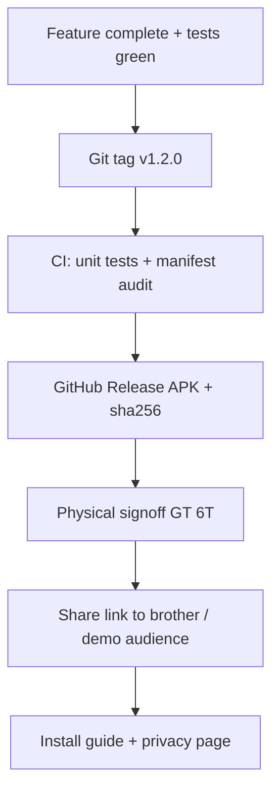

# Khidki release plan — Play Store feasibility & distribution strategy

**Date:** 2026-09-12  
**Status:** Proposal — awaiting owner decision  
**Context:** App works on device (v1.2.0). Current distribution is GitHub Releases sideload. Owner asked whether we can release on Google Play.

---

## Executive answer

| Question | Answer |
|---|---|
| Can Khidki ship on Google Play **as it is today**? | **Almost certainly no.** Google will reject or remove it during the SMS permissions review. |
| Can we “release” it for you + your brother to use reliably? | **Yes — already doing this.** GitHub Releases + sideload is the correct channel for this product. |
| Should we invest in Play Console setup now? | **Only if you intend a major product pivot** (see §3). Otherwise: polish sideload distribution instead. |

This is not a technical blocker — it is a **policy fit** problem. Khidki’s core job (read OTP SMS → forward SMS to another number) is exactly the abuse pattern Play restricts.

---

## 1. What “release” means (pick your goal)

Before spending money/time, choose the target:

| Goal | Channel | Play Store? | Effort |
|---|---|---|---|
| **A. Personal use** (you + brother) | GitHub Releases APK | No | ✅ Done |
| **B. Trusted friends / demo** | Signed APK link + install guide | No | Low |
| **C. Small closed beta** (<100 testers) | Play **closed testing** *or* sideload | Closed test still needs SMS policy approval | Medium–High |
| **D. Public app** | Play **production** | Needs policy approval + store listing | High |
| **E. Open-source community** | F-Droid | Explicitly excluded in `DECISIONS.md` | — |

**Recommendation:** Target **A → B** now. Treat Play as **out of scope** unless you reopen product decisions in §3.

---

## 2. Why Google Play will reject Khidki (current design)

### 2.1 SMS permissions are restricted

Khidki declares:

- `RECEIVE_SMS`
- `SEND_SMS`
- `POST_NOTIFICATIONS`

Google Play’s [Permissions and APIs that Access Sensitive Information](https://support.google.com/googleplay/android-developer/answer/16324062) policy states that apps using the SMS permission group must generally be the **default SMS or Assistant handler**, unless they qualify for a **narrow exception** (emergency alerts, in-vehicle, SMS-based financial transactions, connected-device companion sync, etc.).

Khidki is none of these:

| Khidki behavior | Play policy fit |
|---|---|
| Listen for inbound SMS (including OTPs) | ❌ Not a permitted non-handler use case |
| Forward full message body to a third number | ❌ Looks like OTP interception / smishing tooling |
| Armed via `req <password>` SMS command | ❌ Not default-SMS-app behavior |
| No inbox, compose UI, or user messaging | ❌ Cannot honestly be “default SMS handler” |

### 2.2 Locked decisions block the usual workaround

`docs/DECISIONS.md` explicitly excludes:

- Becoming the **default SMS app** to bypass restrictions
- Notification-listener or accessibility-based SMS capture
- Server/internet relay

Becoming default SMS handler would require building a **real SMS client** (inbox, threads, compose, MMS, contacts integration) — a different product — and users would have to replace Google Messages. That is a multi-month project and still may not justify OTP forwarding to arbitrary numbers.

### 2.3 Review reality

Even **closed testing** and **internal testing** tracks upload the same manifest. Google runs the **Permissions Declaration Form** on bundles that declare SMS permissions. Expect:

1. Upload AAB → flagged for SMS declaration
2. Submit justification → **no matching use case**
3. Rejection or forced permission removal (which bricks the app)

Appeals for “personal OTP forwarding for family” are not a documented exception. Do not plan on a reviewer granting a one-off exception.

### 2.4 What Play *would* require (minimum bar)

If you still wanted to try (not recommended):

| Requirement | Khidki today |
|---|---|
| Play App Signing + upload key | ❌ Uses debug keystore for release |
| AAB (not APK) for production | ❌ CI ships APK |
| Privacy policy URL | ❌ None hosted |
| Data safety form | ❌ Not filled |
| Permissions declaration video + justification | ❌ No compliant story |
| Store listing (screenshots, description, content rating) | ❌ Not prepared |
| Target API compliance | ✅ targetSdk 36 |

Policy aside, you are not yet at “Play upload ready” technically.

---

## 3. Product pivots that *could* reach Play (only if you want to reopen decisions)

These are **not recommendations** — they change what Khidki is.

### Option P1 — Full default SMS app (high effort, weak fit)

- Build inbox + compose + default handler flow
- Still unlikely to justify **forwarding OTPs to another phone** under policy
- Conflicts with “personal sideload tool” identity

### Option P2 — Remove SMS permissions entirely (different app)

- e.g. user manually copies OTP, or uses a server/Telegram bot
- Conflicts with locked “no server / no internet” decisions

### Option P3 — Reframe as “companion / device sync” (stretch)

- Play allows some **connected device** exceptions for SMS on a paired device
- Khidki forwards to an arbitrary phone number, not a paired wearable — weak case

### Option P4 — Enterprise / private distribution outside Play

- **Managed Google Play** (organization) — still policy-bound for public Play; private org apps have some flexibility but SMS permissions remain scrutinized
- **MDM sideload** — same APK, different install path; no Play review, same sideload friction

**Verdict:** None of these are worth pursuing unless the product goal changes from “personal OTP window” to something else.

---

## 4. Recommended release strategy (no Play Store)

Treat **v1.2.0** as the first “real” release. Play Store is replaced by a **trusted sideload release pipeline** you already have.

### Phase R1 — Release hygiene (1–2 days)

**Goal:** Installable, traceable, signed builds for non-developers.

| Task | Detail | Owner |
|---|---|---|
| R1.1 | Create **release keystore** (not debug); store in 1Password/local safe; add `KHIDKI_RELEASE_KEYSTORE_BASE64` GitHub secret | Laraib |
| R1.2 | Wire `signingConfigs.release` in `app/build.gradle.kts` | Dev |
| R1.3 | Tag milestone: `git tag -a v1.2.0 -m "First production release"` → CI publishes `v1.2.0` release | Laraib |
| R1.4 | Run full `docs/PHYSICAL_TEST.md` matrix; record results in `docs/TEST_RESULTS.md` | Laraib |
| R1.5 | Update `README.md` (still says preview/debug in places) | Dev |

**Done when:** Brother can install from GitHub Releases without uninstalling due to keystore mismatch.

### Phase R2 — Distribution polish (2–3 days)

**Goal:** Demo-ready and share-ready without Play Store.

| Task | Detail |
|---|---|
| R2.1 | Host **privacy policy** (GitHub Pages or `docs/PRIVACY.md` on a public gist) — required for credibility even sideloading |
| R2.2 | One-page **install guide** with screenshots: restricted settings, SMS allow, Realme auto-start, timed arm flow |
| R2.3 | Add `CHANGELOG.md` with v1.2.0 user-facing notes |
| R2.4 | Optional: QR code in README pointing to latest release URL |
| R2.5 | Decide repo visibility: **private** (current) vs **public** (easier sharing; exposes code) |

**Done when:** You can hand someone a link + 5-step guide and they succeed without you on a call.

### Phase R3 — Operational release cadence (ongoing)

| Event | Action |
|---|---|
| Bugfix on `main` | Auto `v1.2.0-b<N>` CI release (current) |
| User-visible milestone | Annotated tag `v1.3.0` |
| Breaking install (keystore / package ID) | Document in RELEASE.md + bump major |

---

## 5. If you still want Play Console (decision gate)

Only proceed if **all** are true:

1. You accept that Khidki will likely be **rejected** unless the product changes materially.
2. You are willing to pay the **$25** developer fee and spend **review cycles**.
3. You will **not** misdeclare the use case (risk: developer account strike).

### Minimal Play experiment (expect failure, learn fast)

| Step | Action |
|---|---|
| 1 | Create Play developer account |
| 2 | Generate upload keystore + enable Play App Signing |
| 3 | Build `:app:bundleRelease` AAB |
| 4 | Create app → **Internal testing** track (not production) |
| 5 | Fill Data safety: “No data collected”, “No data shared”, on-device SMS processing |
| 6 | Submit Permissions Declaration honestly: “Forwards OTP SMS to configured number” |
| 7 | Record rejection reason → archive in `docs/DECISIONS.md` |

**Expected outcome:** Rejection citing SMS permissions policy. Then close the experiment and stay on GitHub Releases.

---

## 6. Play Store checklist (reference — for P1 pivot only)

Use this only if product decisions change.

### Store assets

- [ ] App name: Khidki
- [ ] Short description (80 chars)
- [ ] Full description (disclose SMS forwarding risk plainly)
- [ ] App icon 512×512 (have adaptive icon — export hi-res)
- [ ] Feature graphic 1024×500
- [ ] Phone screenshots (Status, Configs, Timed arm, Permissions, Settings)
- [ ] Content rating questionnaire
- [ ] Target countries (India)

### Policy & compliance

- [ ] Privacy policy URL
- [ ] Data safety form
- [ ] SMS permissions declaration + demo video
- [ ] No `INTERNET` permission (keep audit)
- [ ] Account deletion — N/A (no accounts); state clearly

### Technical

- [ ] AAB via `bundleRelease`
- [ ] Play App Signing
- [ ] Release keystore in CI secrets
- [ ] ProGuard mapping file uploaded for crash deobfuscation
- [ ] `versionCode` monotonic per upload

---

## 7. Alternatives to Play Store

| Channel | Pros | Cons |
|---|---|---|
| **GitHub Releases** (current) | Full control, no policy, matches “personal tool” | Sideload friction, restricted settings, no auto-update |
| **Direct APK** (Signal/Drive) | Easiest for one person | No integrity checksum habit, manual updates |
| **Obtainium** (if repo public) | Auto-update sideload | Needs public release URL |
| **Samsung Galaxy Store** | Alternative store | Same SMS policy scrutiny likely |
| **Amazon Appstore** | Alternative | Same issue |
| **Enterprise MDM** | Fleet install | Overkill for 2 users |

---

## 8. Decisions needed from Laraib

Answer these to unblock next work:

1. **Distribution goal:** A (personal) / B (trusted demo) / C (closed beta) / D (public Play)?  
   → Recommended: **B**

2. **Play Store:** Accept **no** for v1 and stay sideload?  
   → Recommended: **yes**

3. **Release signing:** Create proper release keystore now?  
   → Recommended: **yes** (before brother depends on a specific install)

4. **Repo visibility:** Keep private or open source for easier sharing?  
   → Your call

5. **Reopen `DECISIONS.md` distribution section?** Only if you want to pursue Play pivot P1–P3.

---

## 9. Suggested immediate next steps

1. **Do not** start Play Console production setup yet.
2. **Do** run Phase R1 (release keystore + `v1.2.0` tag + physical test signoff).
3. **Do** run Phase R2 (privacy URL + install guide) before demoing to anyone outside family.
4. If curious: optional Play **internal testing** experiment (§5) with eyes open — document rejection, move on.

---

## References

- [Google Play — Permissions and sensitive APIs](https://support.google.com/googleplay/android-developer/answer/16324062)
- [Google Play — SMS / Call Log permission groups](https://support.google.com/googleplay/android-developer/answer/17225965)
- [Android — Default handler permissions](https://developer.android.com/guide/topics/permissions/default-handlers)
- Internal: `docs/DECISIONS.md`, `docs/PRIVACY.md`, `docs/RELEASE.md`, `docs/PHYSICAL_TEST.md`
