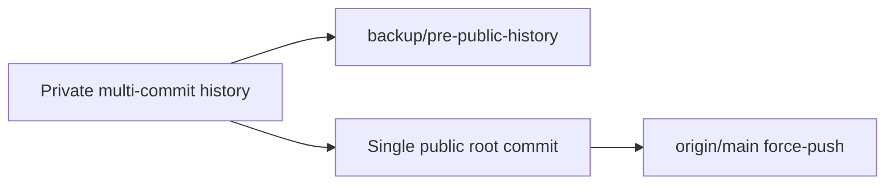

# Khidki public readiness (logic, hygiene, clean history)

**Project:** [~/pers/window-sms](.) (`laraib-sidd/khidki`). FOSS files from the last pass may still be **uncommitted** — fold them into this work, do not open a second FOSS branch.

**Verdict:** Core v1.5 (people, Until I stop, Start/Stop, shade Stop) works. **Not** ready to share until the P0s below land. Animation is optional cheap Material, not a redesign.

## Locked decisions

- **History:** **orphan + one (or two) clean commits** on a new root. Old GitHub SHAs die after **you** confirm `git push --force`. No rewrite until that confirm. Tags `v1.5.0-b`* can stay as historical artifacts or you delete them.
- **Play Store:** still out. **GPL-3.0-or-later** stays. GitHub Releases + later F-Droid; two signing keys.
- **Pause:** **remove shade Pause**. Stop only. `isMasterEnabled` stays true except we delete the Pause action. Start on Home is the only arm. (Resume-from-shade is a later bead.)
- **Until I stop + reboot:** keep boot-expire (security). Document it in Home/INSTALL ("restarts if the phone reboots").
- **Default filters:** keep Government **off**. One welcome line: EPF/tax only if you turn Government on.
- **Room:** this pass **does not** drop `credentials` / `configurations` tables (needs a careful v5). Delete **Kotlin callers** of `req` so they are not in the public source surface; leave empty tables.
- **No INTERNET.** No history rewrite of the private repo until orphan is approved.

## P0 — must fix (logic)

1. **Fan-out budget** in `[ForwardingEngine.handleTimedCandidate](app/src/main/java/dev/laraib/khidki/domain/session/ForwardingEngine.kt)`: today `canReserve(parts * destinationCount)` uses `MAX_PARTS_PER_MESSAGE` (3) as a **total**, so 4 people (or 2 people × 2-part SMS) falsely `BudgetExceeded`. Reserve/check **per outbound SMS** (still cap **each** body at 3 parts). Add a test: 4 destinations, 1-part OTP → 4 sends.
2. **Welcome traps** in `[WelcomeSheet.kt](app/src/main/java/dev/laraib/khidki/ui/components/WelcomeSheet.kt)` / `[MainActivity.kt](app/src/main/java/dev/laraib/khidki/ui/MainActivity.kt)`: Skip sets `welcomeCompleted` and snackbar "add a person on Rules"; `completeWelcome` failure **must keep the sheet open**.
3. **Pause honesty:** delete `ACTION_PAUSE_APP` from `[ForwardingNotificationManager.kt](app/src/main/java/dev/laraib/khidki/platform/notification/ForwardingNotificationManager.kt)` + `[NotificationActionReceiver.kt](app/src/main/java/dev/laraib/khidki/platform/notification/NotificationActionReceiverTest.kt)`. Keep **Stop forwarding**. Fix error copy that says "unpause in notification". Align README ("Stop on Home or shade").

## P1 — garbage / dead `req` stack (delete from `src/main`)

Ingress already only calls `handleCandidate` (`[SmsInboundProcessor.kt](app/src/main/java/dev/laraib/khidki/platform/sms/SmsInboundProcessor.kt)`). Remove unused:

- `RequestParser`, `CredentialGenerator`, `DeviceCredentialGate`, `ConfirmDeleteDialog` wait — **wire** ConfirmDelete on person delete, don't delete the dialog.
- `ForwardingEngine.handleCommand` + REQUEST candidate branch + deprecated `armTimedWindow` overloads; update tests to destinations API only.
- Unwire `DefaultRequestAuthenticator` from `[KhidkiRuntime.kt](app/src/main/java/dev/laraib/khidki/KhidkiRuntime.kt)` if nothing calls it.
- `[ConfirmDeleteDialog.kt](app/src/main/java/dev/laraib/khidki/ui/components/ConfirmDeleteDialog.kt)`: **use** it on Rules delete.

Keep gated regex tester (triple-tap version). Keep placeholder config seeder until a later schema bead.

## P1 — copy, docs, tiny UX

- Strings: welcome is **people + SMS you choose**, not "trusted number" / OTP-only. Kill unused `settings_trusted_number_`*.
- Rewrite user-facing docs that still teach Master/`req`: `[docs/ARCHITECTURE.md](docs/ARCHITECTURE.md)`, `[docs/PHYSICAL_TEST.md](docs/PHYSICAL_TEST.md)`, locked table in `[docs/DECISIONS.md](docs/DECISIONS.md)`. Historical `docs/plans/` stay.
- Notification: on `CANDIDATE_FORWARDED`, call `showOngoing(session)` so the count updates.
- Home: if paused leftover never happens after Pause removal; if `destinations.isEmpty()`, don't show "Forwarding to 0 people" as the primary CTA — point to Rules.
- **Motion (cheap, one pass):** `AnimatedContent` on welcome steps; `Crossfade` Home idle vs active card. No Lottie, no redesign.
- Stop button: error/destructive color, not success green.
- CI: `[scripts/generate_release_notes.sh](scripts/generate_release_notes.sh)` still says "debug"; fix. Remove hardcoded `"khidki-release"` store passwords from `[app/build.gradle.kts](app/build.gradle.kts)` (fail closed if secret file missing; debug keystore stays).

Out of scope: 1024 store graphic, Play, INTERNET, Room v5 drop, reproducible F-Droid signing, Government default on.

## History procedure (after code is green)

Working tree today includes uncommitted FOSS + this polish. After tests pass:

```bash
cd ~/pers/window-sms
# backup branch
git branch backup/pre-public-history main
git checkout --orphan public-v151
git add -A
git commit -m "Release Khidki 1.5.1 as GPL-3.0-or-later public source."
# you confirm:
git branch -M main
git push --force origin main
```

Do **not** force-push until you say so. GitHub Releases already published stay; new `v1.5.1` tag after the orphan commit.



## Test / done

```bash
cd ~/pers/window-sms
./gradlew :app:testDebugUnitTest
./gradlew :app:assembleRelease
bash scripts/audit_manifest.sh
```

Must include: 4-destination fan-out test; until-stop still ignores wall clock; EPF still Government-only; notification Stop still cancels; Pause action gone.

**Done:** P0s fixed, `req` not in main compile path, copy/docs match v1.5, cheap motion, FOSS files included, tests green, orphan commit **prepared**. Public visibility + force-push + F-Droid MR remain **human**.
